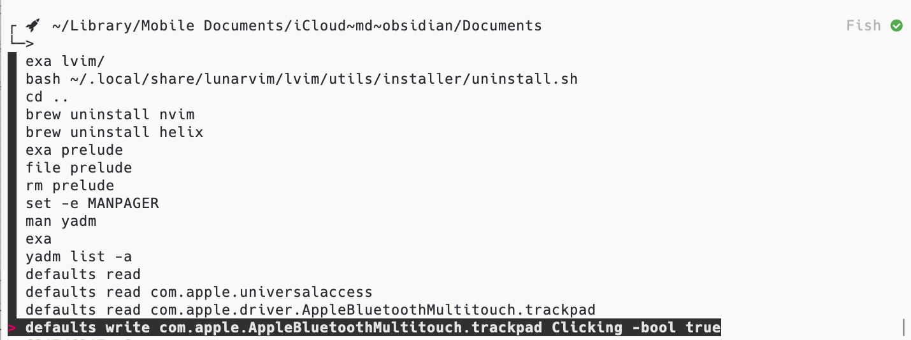
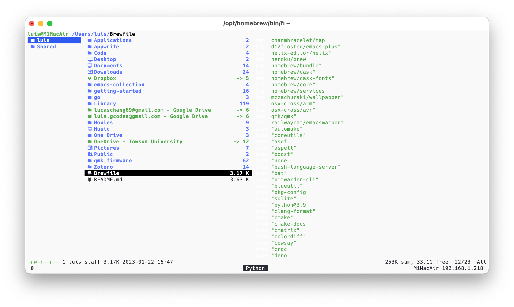
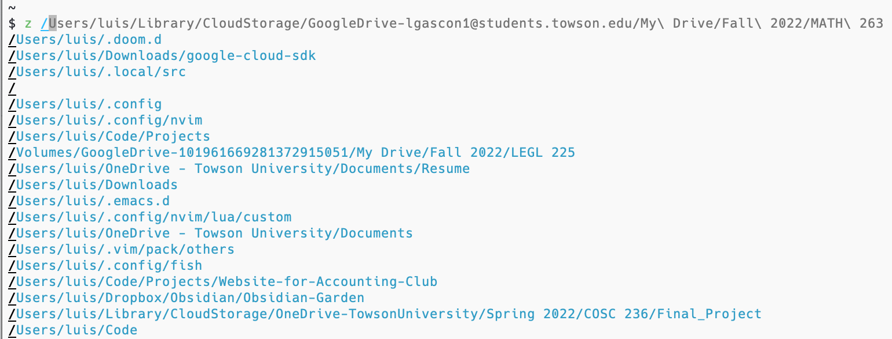
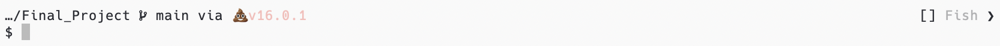
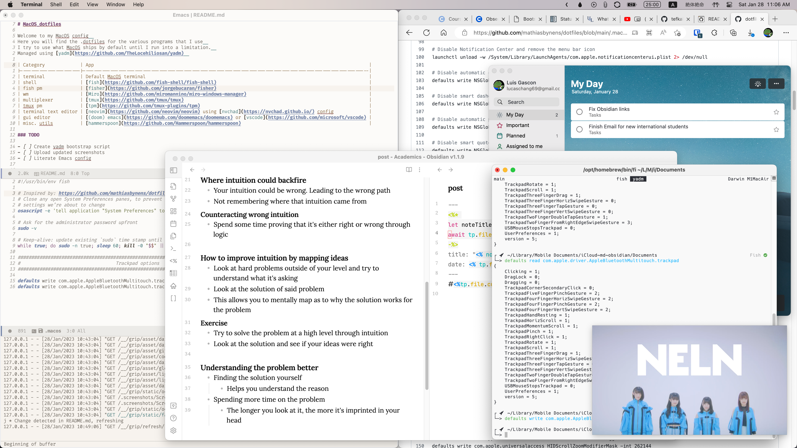
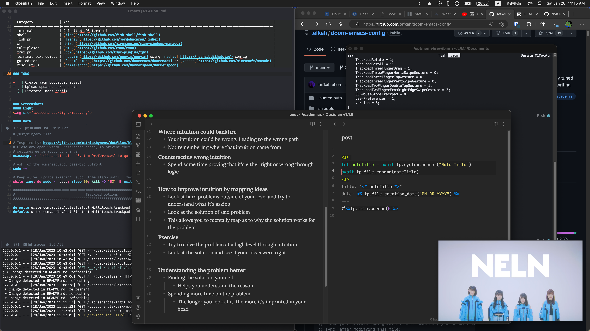

# MacOS_dotfiles

Welcome to my MacOS config  
Here you will find the .dotfiles for the various programs that I use  
The accumulation of my frustration and multiple Google searches.  
Managed using [yadm](https://github.com/TheLocehiliosan/yadm)  

## CLI Essentials
### [fzf](https://github.com/junegunn/fzf)
- Fuzzy finding is such a game changer

|  |
|:----------------------------------------:|
| fzf command history search in action   |

### [ranger](https://github.com/ranger/ranger)
- Finder for MacOS is so bad, I'd rather use the terminal to explore my files.
- Supports image previewing but I'm not using a terminal that enables it so I guess that's one thing Finder is better at.

|  |
|:------------------------------------------------:|
| *Home is whenever I'm with you <3*               |

### [tmux](https://github.com/tmux/tmux)
- The MacOS terminal default pane splitting is 🤮
- Persistent sessions are really handy.
    - For example, I can open a new terminal window and switch to an existing session, with all the panes and windows.
#### [tmux plugin manager](https://github.com/tmux-plugins/tpm)
- Adds different functionalities that others have created, with ease.
- Out of pure laziness, I will not re-invent the wheel.

### [Fish](https://github.com/fish-shell/fish-shell)
- Out of the box fish experience is amazing!
- One downside is that I can't just copy paste POSIX compliant one liners. I would have to switch to my alternate shell, which is zsh.
#### [Fisher, a fish plugin manager](https://github.com/jorgebucaran/fisher)
- Similar to tpm, I am not re-inventing the wheel.
- The only fish plugin manager that officially supports fzf.fish
##### Notable installed packages
- [z](https://github.com/jethrokuan/z)
  - Keeps track of the directories you've recently visited.
  - Essentially allows you to traverse to previous directories blazing fast.

|  |
|:------------------------------------:|
| *Tabbing my way down town*           |
  
- [fzf.fish](https://github.com/PatrickF1/fzf.fish)
  - As mentioned before, fzf is an absolute game changer.
  - Includes comfortable key bindings, unlike Emacs.
    
### Font
- [Nerd Font](https://github.com/ryanoasis/nerd-fonts) is a must to render cool characters.
- I personally like Hack Nerd Font. It's easy to read and it doesn't look edgy.

### [Starship prompt](https://starship.rs/)
- One shell prompt to rule them all!
- Consistent prompts across different shells and it includes batteries!

|  |
|:-------------------------------------------------:|
| Java project spotted!                             |


## Desktop Experience
### [Hammerspoon](https://github.com/Hammerspoon/hammerspoon)
- Lua scripting for Macos
- Disclaimer: I'm a Lua script kiddie.
- Instead of installing a whole different application for one purpose, I just clone spoons that achieve the same goal, such the window manager that I currently use. Of course, there are limitations, but this is fine for now.

### [Miro Window Manager](https://github.com/miromannino/miro-windows-manager)
- Keeps window management simple.
- It snaps and resizes windows similar to Windows, which I'm accustomed to.
- Yes, I have tried tiling. Just not my jam.
### [Zathura](https://github.com/pwmt/zathura)
- My go to pdf viewer when I was a Linux user.
- What a shame scrolling documents in MacOS is 👎.
  - See this [Github issue](https://github.com/zegervdv/homebrew-zathura/issues/79)
  - Opting for mouse scroll because it's *Smooth*
### [Terminal theme auto switcher](https://github.com/patrik-csak/auto-terminal-profile)
- Switches MacOS terminal theme based on system theme
```bash
# Quick setup
$ npm install --global auto-terminal-profile
$ auto-terminal-profile set-light-profile "Atom One Light"
$ auto-terminal-profile set-dark-profile "Neutron"
$ auto-terminal-profile enable
```
## Editing the sacred texts
### [Doom Emacs](https://github.com/doomemacs/doomemacs)
- The Emacs framework that I start with and the one I might stick with.
- Evil all the way 😈
- Better documentation on my Doom Emacs configuration in the future with a literate config.
### [Vim](https://www.vim.org/)
- My first Linux text editor!
- Mainly used for quick editing or reading in the terminal
- Keeping it as minimal as possible. 
## TODO
- [ ] Create yadm bootstrap script
- [ ] Upload updated screenshots
- [ ] Literate Emacs config
- [ ] Finish .macos script

### Screenshots
I unironically enjoy using light themes. My application colorshcemes are set to change based on system theme, which is set to Auto.  
Consistency is bliss
#### Light


#### Dark


